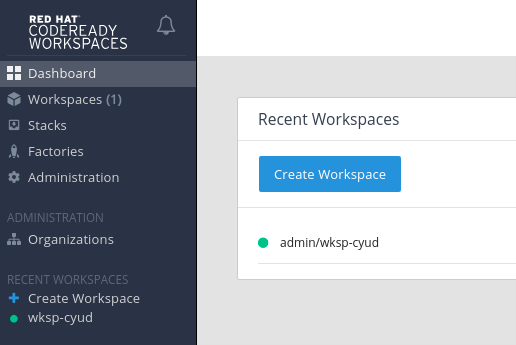
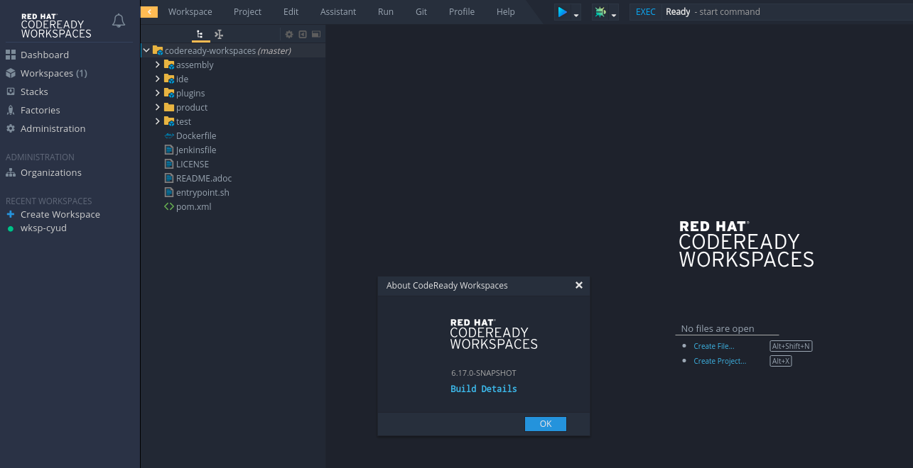

= Building Codeready Workspaces and Testing with Minishift

Below are instructions to build the Codeready Workspaces (CRW) assembly locally with Minishift, in order to test changes.

The instructions below assume you're running Fedora 29, but similar instructions should also work on MacOS or other Linuxes.

NOTE: Managed to get this to work on Windows 10 w/ Virtual Box 6.0.4, using link:https://conemu.github.io/[ConEmu] and a combination of Git Bash, WSL Bash. Some commands work in some shells, some do not. YMMV.

== Set up Minishift

Download and unpack the latest `minishift` v1.34 binary from here:

https://github.com/minishift/minishift/releases

You'll also want the Openshift Origin Client Tools (`oc`) v3.11.0+0cbc58b from:

https://github.com/openshift/origin/releases

Once downloaded and unpacked, put the `minishift` and `oc` executables in your ~/bin or other folder that's on your PATH.

== Start up Minishift

If on Windows, try Git bash shell for these steps.

```
# To prevent rate limiting when starting minishift, use a personal access token.
# You can create new one at https://github.com/settings/tokens
export MINISHIFT_GITHUB_API_TOKEN="f00cafebabel33t"

# Grant enough memory to run CRW 1.2 / Che 6 and workspace - 6G min for one workspace, plus 2G for each additional workspace
minishift config set memory 12G

# if not using default virtualization engine, eg., want Virtual Box, use
minishift config set vm-driver virtualbox

# enable cluster admin user
minishift addons install --defaults
minishift addons enable admin-user
```

If you'd also like to try the latest Che 7, you can enable it as follows:

```
minishift addons enable che; minishift addons apply \
  --addon-env CHE_DOCKER_IMAGE=eclipse/che-server:nightly \
  --addon-env OPENSHIFT_TOKEN=$(oc whoami -t) che

# switch to Che 7.0.0.RC2 plugin registry format - see https://github.com/minishift/minishift/commit/4c0a0c0b9cfb92798fef53e5c54e80ca71c5f715
minishift --profile che addons apply --addon-env PLUGIN__REGISTRY__URL=https://che-plugin-registry.openshift.io/v3 che
```

If on Windows, you might need to touch a file that your shell can't find. Try git bash shell for this:

```
touch /c/Users/YOUR_LOGIN_HERE/.minishift/machines/minishift_kubeconfig
```

If on Windows, try Git bash shell for this step.

NOTE: If it fails with error `Checking if requested OpenShift version 'v3.11.0' is valid ... v3.11.0 is not a valid OpenShift versionFAIL`, try WSL bash shell.

```
# start minishift oc cluster
minishift start
```

Once minishift starts successfully, you're ready to deploy CRW to the server. If minishift fails to come up, try killing and starting it again:

```
minishift stop
minishift start
```

Or delete it and try again:

```
minishift stop
minishift delete
minishift start
```

When successfull, you should see something like this (use your actual IP address in place of `192.168.$YOUR_IP`):

```
OpenShift server started.

The server is accessible via web console at:
    https://192.168.$YOUR_IP:8443/console
```

You can log into the above console URL using user = `system` and password = `admin` - full cluster admin privileges required to deploy an operator:

```
oc login 192.168.$YOUR_IP:8443 -u system -p admin
```

If you prefer to use a different user, you can grant that user cluster admin privileges:

```
oc adm policy --as=system:admin add-cluster-role-to-user cluster-admin admin # for admin user
oc adm policy  --as system:admin add-cluster-role-to-user cluster-admin developer # for developer user
```

== Enable authenticated login to registry.redhat.io

As of CRW 1.2, you need to authenticate with `registry.redhat.io` to pull CRW images.

. Get a login for the registry.   Details: https://access.redhat.com/RegistryAuthentication#getting-a-red-hat-login-2

. Log in using your new username. Details: https://access.redhat.com/RegistryAuthentication#using-authentication-3
+
To keep your registry.redhat.io login secret in a separate file, such as `/tmp/CRW.docker.config.json`:
+
    docker --config /tmp/CRW.docker.config.json login https://registry.redhat.io
+
Otherwise your secret will be stored in `~/.docker/config.json`, and all your secrets will be imported to openshift in the next step.

. Add your secret to your openshift:
+
```
oc create secret generic registryredhatio \
--type=kubernetes.io/dockerconfigjson \
--from-file=.dockerconfigjson=/tmp/CRW.docker.config.json

oc secrets link default registryredhatio --for=pull
oc secrets link builder registryredhatio
```

. If successful, this query will show your new secret:

    oc get secret registryredhatio

.  If unsuccessful, see https://access.redhat.com/RegistryAuthentication#allowing-pods-to-reference-images-from-other-secured-registries-9


== Deploy CRW to Minishift (first time only)

If on Windows, try Git bash shell for this step.

```
# set up path where we'll check out code
export WORKSPACE=/home/${USER}/projects
mkdir -p ${WORKSPACE} && cd ${WORKSPACE}

# get the deploy script and json
git clone https://github.com/redhat-developer/codeready-workspaces-deprecated
cd codeready-workspaces-deprecated/operator-installer

# git checkout 6.19.x # for CRW 1.x
# git checkout master # for CRW 2.0 - 2.3
git checkout crw-2.5-rhel-8 # for 2.4
# TODO: update this script to work w/ latest 2.x

# delete existing crw deployment if it exists
oc login 192.168.$YOUR_IP:8443 -u system -p admin && \
if [[ $(oc project list 2>&1 | grep crw) ]]; then oc delete project crw; fi
```

Next, deploy CRW to Minishift cluster.

. To run the latest public release from Red Hat Container Catalogue:
+
```
REGISTRY=registry.redhat.io/codeready-workspaces
./deploy.sh -d -p=crw \
  --operator-image=${REGISTRY}/server-operator-rhel8:1.2 \
  --server-image=${REGISTRY}/server-rhel8  --version=1.2
```

. Or, to run something newer from Quay (pre-release):
+
NOTE: Container image names are different from the officially released ones. Browse for the latest link:https://quay.io/repository/crw/operator-rhel8?tab=tags[operator] and link:https://quay.io/repository/crw/server-rhel8?tab=tags[server] to get specific tags instead of `1.2-x` or `1.2-y`.

```
REGISTRY=quay.io/crw
./deploy.sh -d -p=crw \
  --operator-image=${REGISTRY}/operator-rhel8:1.2-x \
  --server-image=${REGISTRY}/server-rhel8 --version=1.2-y
```

When successfull, you should see something like this (IP address may vary):

```
[INFO]: CodeReady Workspaces successfully deployed and available at http://codeready-crw.192.168.$YOUR_IP.nip.io
```

The dashboard can be see here:

http://codeready-crw.192.168.$YOUR_IP.nip.io/dashboard/#/

To log in to the dashboard, use username = `admin` and password = `admin`.

You can then create a workspace using some stack to see CRW in action.



== Make changes to CRW deployment

Optionally, you can configure your Minishift to point at a different server-image container than the one you used above.

Edit this path in your https://192.168.$YOUR_IP:8443/console/project/crw/edit/yaml?kind=Deployment&name=che&group=apps&returnURL=[/console/project/crw/edit/yaml?kind=Deployment&name=che&group=apps&returnURL=] to point at the container you're going to build locally:

```
spec:
      containers:
        - env:
           …
          image: 'codeready-workspaces/server-rhel8:1.2'
```

Ensure that the image pull policy is `Always`.

Save your changes, and remember the image path/name:tag you used. You'll need it later.

Or if you skipped this step, just remember the image path/name:tag you deployed initially above.


== Build CRW assemblies

Now you can iterate changes to the code, by rebuilding the CRW assemblies then the container image.


. Set up docker environment and fetch sources to build
+
```
# SUPER IMPORTANT! Ensure we're using the docker daemon inside Minishift, not your local one
eval $(minishift docker-env)

# set up path where we'll check out code
export WORKSPACE=/home/${USER}/projects
mkdir -p ~${WORKSPACE} && cd ${WORKSPACE}

# get sources
git clone git@github.com:redhat-developer/codeready-workspaces.git
cd ~/projects/codeready-workspaces
```

. Make some changes to the code, then build it:
+
```
mvn clean install
```

. You should see something like this:
+
```
[INFO] Reactor Summary:
[INFO]
[INFO] CRW :: Parent 2.1.0.GA ............................. SUCCESS [  3.140 s]
[INFO] CRW :: Assembly :: Parent .......................... SUCCESS [  0.092 s]
[INFO] CRW :: Assembly :: Dashboard ....................... SUCCESS [  3.631 s]
[INFO] CRW :: Assembly :: Tomcat .......................... SUCCESS [ 13.999 s]
[INFO] CRW :: Test :: Parent .............................. SUCCESS [  0.101 s]
[INFO] CRW :: Test :: E2E ................................. SUCCESS [ 18.682 s]
[INFO] CRW :: Test :: Performance 2.1.0.GA ................ SUCCESS [  0.245 s]
[INFO] ------------------------------------------------------------------------
[INFO] BUILD SUCCESS
[INFO] ------------------------------------------------------------------------
[INFO] Total time: 41.154 s
```

. Use the `Dockerfile` in this repo to build. Note: use the same image path and tag that you deployed to Minishift (or the alternate path/name:tag you set above).
+
```
cd ~/projects/codeready-workspaces
docker build --force-rm -t registry.redhat.io/codeready-workspaces/server-rhel8:1.2 . && \
docker images | grep registry.redhat.io/codeready-workspaces/server-rhel8:1.2
```

. Take down the old pod and replace it with a new one
+
```
oc login 192.168.$YOUR_IP:8443 -u system -p admin && \
oc project crw && \
oc scale deployment che --replicas=0; sleep 5s; \
oc scale deployment che --replicas=1; sleep 55s
```

Launch a new incognito browser tab to see changes to your workspace (workspace name will be the same as the one you created above, not `wksp-cyud`):

```
google-chrome --incognito "http://codeready-crw.192.168.$YOUR_IP.nip.io/dashboard/#/ide/admin/wksp-cyud"
```

If prompted to log in, use username = `admin` and password = `admin`.


