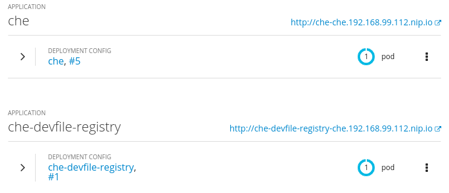
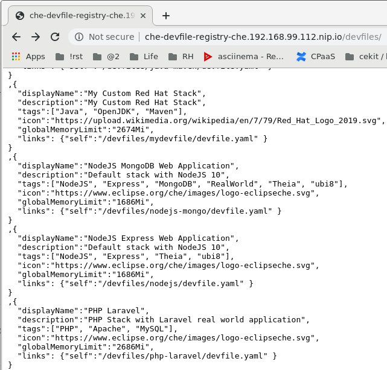
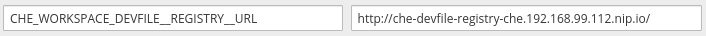

= Creating your own devfile registry

== Prerequisites

You need a Kubernetes or OpenShift cluster (eg., minikube or minishift), into which you have installed Che. Follow the steps in link:che7-minishift-deployment.adoc[this document] to deploy Che.

Steps below can then be done to deploy a custom devfile registry to your cluster, and use it with Che.

== Procedure

. Check out https://github.com/eclipse/che-devfile-registry/
+
```
git clone https://github.com/eclipse/che-devfile-registry/
cd che-devfile-registry
```

. Make changes in the `devfiles/` folder to add new or remove existing devfile folders from the registry.

. Build the image.
+
[NOTE]
====
This example uses a personal quay repository and an arbitrary tag `ubi8-2`, but you can use another image registry and path as needed.
====
+
```
docker build . -f Dockerfile.ubi8 --no-cache \
  -t quay.io/nickboldt/che-devfile-registry:ubi8-2
```
. Push it to quay (or your image registry of choice)
+
```
docker push quay.io/nickboldt/che-devfile-registry:ubi8-2
```
+
[NOTE]
====
Verify the image and tag you pushed are published, eg.,

* https://quay.io/repository/nickboldt/che-devfile-registry?tab=tags

Verify the *Repository Visibility* is *public*, eg.,

* https://quay.io/repository/nickboldt/che-devfile-registry?tab=settings
====

. Remove any existing `che-devfile-registry` deployments.
+
```
oc delete dc che-devfile-registry; \
oc delete svc che-devfile-registry; \
oc delete route che-devfile-registry; \
sleep 5s
```

. Deploy the new `che-devfile-registry`.
+
```
oc new-app -f deploy/openshift/che-devfile-registry.yaml \
  -p PULL_POLICY="Always" \
  -p IMAGE="quay.io/nickboldt/che-devfile-registry" \
  -p IMAGE_TAG="ubi8-2"; \
sleep 5s
```
+


. You can browse the registry's `devfiles/index.json` file to verify your new devfile is included.
+


. Update your config map to point to the new registry.
+
```
oc set env dc/che CHE_WORKSPACE_DEVFILE__REGISTRY__URL=http://che-devfile-registry-che.192.168.99.112.nip.io/
```
+


. Check your Che deployment to see if the changes are live by creating a new workspace from your devfile registry:
+
* http://che-che.192.168.99.112.nip.io/dashboard/#/create-workspace
+
image::../images/custom-devfile-list.png[custom stack shown when creating a new workspace]
