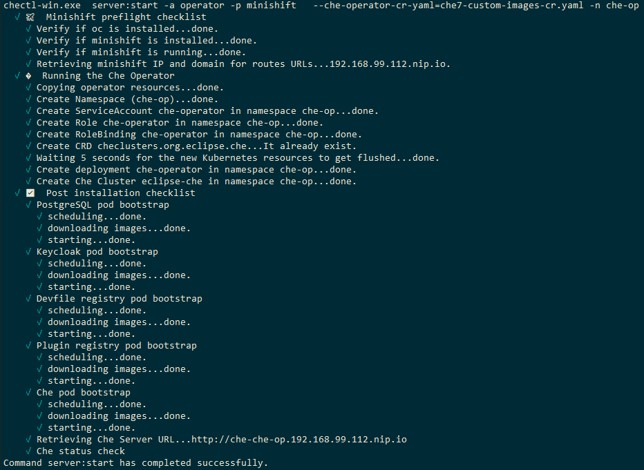
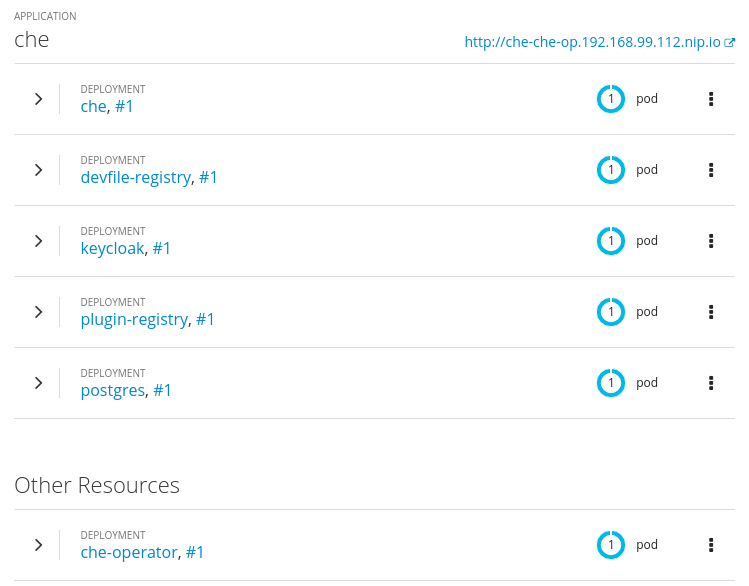
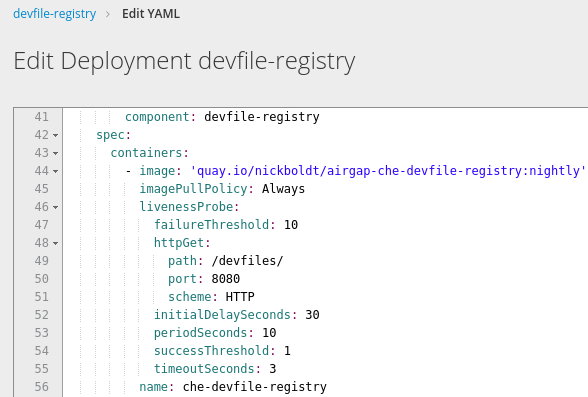

= Deploying Che 7 with custom images

Unlike link:che7-minishift-deployment.adoc[Deploying Che 7 to Minishift 1.34+], this doc will explain how to do an Eclipse Che 7 deployment with a custom resource yaml file to override the images used in the deployment. 

This process can be used for many things, but in this example it'll be in support of an *air gap environment*, where an organization cannot directly see Quay or Red Hat Container Catalog, and must instead reference internally mirrored artifacts within their organization's firewall.

== Prerequisites

You need the latest link:https://github.com/minishift/minishift/releases[Minishift] and link:https://github.com/che-incubator/chectl/releases[chectl] releases.

Fetch them like this (or similar):

```
cd ~/bin
curl -sSL https://github.com/che-incubator/chectl/releases/download/20190724230954/chectl-linux -o chectl
chmod +x chectl
```

```
cd /tmp
curl -sSL https://github.com/minishift/minishift/releases/download/v1.34.1/minishift-1.34.1-linux-amd64.tgz -o minishift.tgz
tar xvzf minishift.tgz
mv minishift*/minishift ~/bin/
chmod +x ~/bin/minishift
```

== Procedure

. Start up minishift. (See link:building-crw.adoc#start-up-minishift[Start up Minishift] for some suggested default settings.) 
+
```
minishift start
```

. Log in once startup is complete.
+
```
oc login 192.168.MY.IP:8433 -u system -p admin
```

. For Eclipse Che 7, pull link:https://github.com/eclipse/che-operator/blob/master/pkg/deploy/defaults.go[these images] and link:che7-custom-images-cr-pull-rename-push.sh[publish them] to your internal registry:

* eclipse/che-server:nightly
* eclipse/che-keycloak:nightly
* quay.io/eclipse/che-devfile-registry:nightly
* quay.io/eclipse/che-plugin-registry:nightly
* centos/postgresql-96-centos7:latest
* registry.access.redhat.com/ubi8-minimal:8.0

. Create a link:che7-custom-images-cr.yaml[custom resource file], which overrides the default image values from link:https://github.com/eclipse/che-operator/blob/master/pkg/deploy/defaults.go[che-operator defaults.go] to use your custom registry's images.
+
[NOTE]
====
To watch the events and verify which images are pulled, see link:che7-minishift-images.adoc[this document] before performing the next step.
====

. Deploy Che to minishift using the custom resource file created above, link:che7-custom-images-cr.yaml[`che7-custom-images-cr.yaml`]. In this example the namespace `che-op` is used instead of the default `che`:
+
```
chectl server:start -a operator -p minishift \
  --che-operator-cr-yaml=che7-custom-images-cr.yaml -n che-op
```
+
[NOTE]
====
If you use the minishift addon to deploy Che (which uses a deployment configuration instead of an operator), your custom resource file will not be used. The addon is deprecated.
====

. You should see this:
+


. Once deployed, you should see these in your Minishift console:
+


. The custom image reference can be seen in the yaml for the deployment:
+ 

